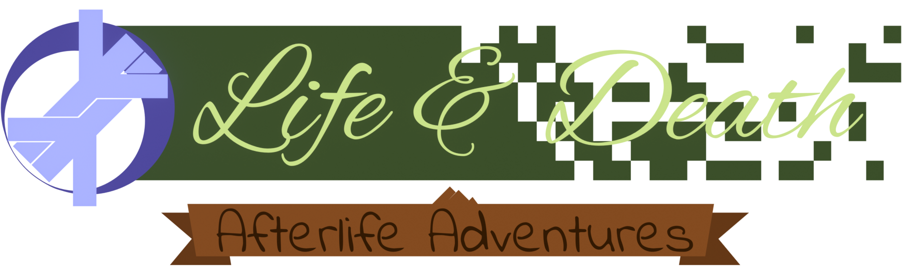

  

&nbsp;

	
	
	
	 
	
	
	

A casual room building, decoration and virtual pet game made in Godot.
This is the FOSS version: all assets, maps, code and included files are released upon GPLv3 license

This repository lets you‥

- Run the open source code to have a fully self-compiled FOSS version of the game
- Propose changes to be merged back into the game.
- Create modifications for Crygotchi that would otherwise be impossible.
- Use helpful code snippets in your projects.
- Create your own "total conversions" that use an entirely new set of assets.

Also, If you would like to distribute any of the original Crygotchi assets for non-Crygotchi assets, you must obtain explicit written permission from CovenFox Studios(Do feel free to @ us on Discord!).

## Technologies used:

- [C# - Programming language](https://github.com/dotnet/csharplang)
- [Godot - Game Engine](https://godotengine.org/)

## Contributors ✨

Thanks goes to these wonderful people for helping with the art direction of the game:

- [YMWS - UI Artist](https://twitter.com/ymwspro)
- [Jay_Wolf66 - Concept Artist](https://twitter.com/JayWolf66)
- [Cry - Cry](https://na11t3.carrd.co/)

And all the contributors who have worked on the source code of the project:

> **💡 Note:** Contributors list made with [contrib.rocks](https://contrib.rocks).
